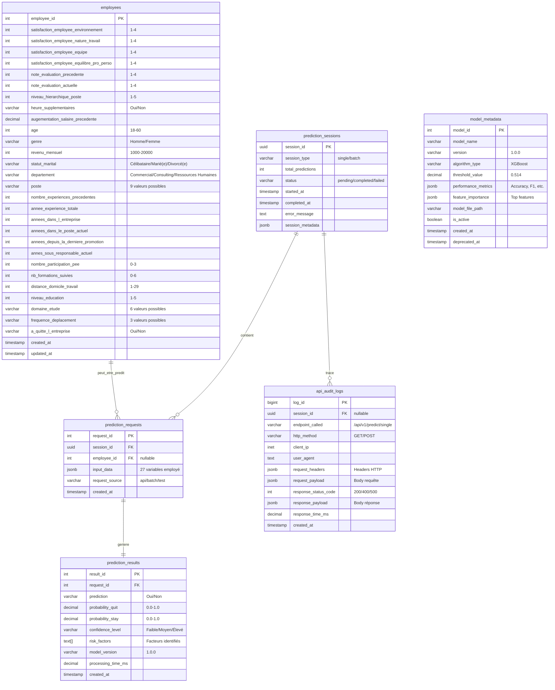

# Schéma UML - Base de données Futurisys ML

## Architecture générale


```mermaid
erDiagram
    employees {
        int employee_id PK
        int satisfaction_employee_environnement "1-4"
        int satisfaction_employee_nature_travail "1-4"
        int satisfaction_employee_equipe "1-4"
        int satisfaction_employee_equilibre_pro_perso "1-4"
        int note_evaluation_precedente "1-4"
        int note_evaluation_actuelle "1-4"
        int niveau_hierarchique_poste "1-5"
        varchar heure_supplementaires "Oui/Non"
        decimal augementation_salaire_precedente
        int age "18-60"
        varchar genre "Homme/Femme"
        int revenu_mensuel "1000-20000"
        varchar statut_marital "Célibataire/Marié(e)/Divorcé(e)"
        varchar departement "Commercial/Consulting/Ressources Humaines"
        varchar poste "9 valeurs possibles"
        int nombre_experiences_precedentes
        int annee_experience_totale
        int annees_dans_l_entreprise
        int annees_dans_le_poste_actuel
        int annees_depuis_la_derniere_promotion
        int annes_sous_responsable_actuel
        int nombre_participation_pee "0-3"
        int nb_formations_suivies "0-6"
        int distance_domicile_travail "1-29"
        int niveau_education "1-5"
        varchar domaine_etude "6 valeurs possibles"
        varchar frequence_deplacement "3 valeurs possibles"
        varchar a_quitte_l_entreprise "Oui/Non"
        timestamp created_at
        timestamp updated_at
    }

    prediction_sessions {
        uuid session_id PK
        varchar session_type "single/batch"
        int total_predictions
        varchar status "pending/completed/failed"
        timestamp started_at
        timestamp completed_at
        text error_message
        jsonb session_metadata
    }

    prediction_requests {
        int request_id PK
        uuid session_id FK
        int employee_id FK "nullable"
        jsonb input_data "27 variables employé"
        varchar request_source "api/batch/test"
        timestamp created_at
    }

    prediction_results {
        int result_id PK
        int request_id FK
        varchar prediction "Oui/Non"
        decimal probability_quit "0.0-1.0"
        decimal probability_stay "0.0-1.0"
        varchar confidence_level "Faible/Moyen/Élevé"
        text[] risk_factors "Facteurs identifiés"
        varchar model_version "1.0.0"
        decimal processing_time_ms
        timestamp created_at
    }

    model_metadata {
        int model_id PK
        varchar model_name
        varchar version "1.0.0"
        varchar algorithm_type "XGBoost"
        decimal threshold_value "0.514"
        jsonb performance_metrics "Accuracy, F1, etc."
        jsonb feature_importance "Top features"
        varchar model_file_path
        boolean is_active
        timestamp created_at
        timestamp deprecated_at
    }

    api_audit_logs {
        bigint log_id PK
        uuid session_id FK "nullable"
        varchar endpoint_called "/api/v1/predict/single"
        varchar http_method "GET/POST"
        inet client_ip
        text user_agent
        jsonb request_headers "Headers HTTP"
        jsonb request_payload "Body requête"
        int response_status_code "200/400/500"
        jsonb response_payload "Body réponse"
        decimal response_time_ms
        timestamp created_at
    }

    employees ||--o{ prediction_requests : "peut_etre_predit"
    prediction_sessions ||--o{ prediction_requests : "contient"
    prediction_requests ||--|| prediction_results : "genere"
    prediction_sessions ||--o{ api_audit_logs : "trace"
```

## Architecture de données détaillée

### Flux de données principal

1. **Session creation** : UUID générée automatiquement via `PredictionLoggerMiddleware`
2. **Request logging** : Input employé (27 variables) stocké en JSONB 
3. **ML Processing** : XGBoost preprocessing → prédiction → postprocessing
4. **Result storage** : Output complet avec explicabilité et métadonnées
5. **Audit trail** : Traçabilité HTTP complète pour conformité

### Table `employees` - Dataset Projet 4 (1470 lignes)

**Variables de satisfaction (échelle 1-4)**
- `satisfaction_employee_environnement`
- `satisfaction_employee_nature_travail`
- `satisfaction_employee_equipe`
- `satisfaction_employee_equilibre_pro_perso`

**Variables d'évaluation (échelle 1-4)**
- `note_evaluation_precedente`
- `note_evaluation_actuelle`

**Variables catégorielles avec contraintes CHECK**
```sql
-- Départements (3 valeurs)
departement IN ('Commercial', 'Consulting', 'Ressources Humaines')

-- Postes (9 valeurs validées)
poste IN (
    'Cadre Commercial', 'Assistant de Direction', 'Consultant',
    'Tech Lead', 'Manager', 'Senior Manager',
    'Représentant Commercial', 'Directeur Technique', 'Ressources Humaines'
)

-- Domaines d'étude (6 valeurs)
domaine_etude IN (
    'Infra & Cloud', 'Autre', 'Transformation Digitale',
    'Marketing', 'Entrepreneuriat', 'Ressources Humaines'
)

-- Fréquence déplacement (3 niveaux pour encodage ordinal)
frequence_deplacement IN ('Aucun', 'Voyage_Rare', 'Voyage_Fréquent')
```

**Target variable**
- `a_quitte_l_entreprise` : Variable cible binaire (Oui/Non)

### Table `prediction_sessions` - Regroupement logique

**Types de sessions**
- `single` : Prédiction individuelle
- `batch` : Prédictions multiples (max 100 employés)

**Statuts de session**
- `pending` : En cours de traitement
- `completed` : Terminée avec succès
- `failed` : Échec avec message d'erreur

**Métadonnées JSONB**
```json
{
  "client_ip": "192.168.1.1",
  "user_agent": "Mozilla/5.0...",
  "endpoint": "/api/v1/predict/single",
  "batch_size": 1,
  "processing_stats": {...}
}
```

### Table `prediction_requests` - Inputs ML tracés

**Structure input_data (JSONB)**
```json
{
  "satisfaction_employee_environnement": 4,
  "satisfaction_employee_nature_travail": 4,
  "age": 35,
  "genre": "Homme",
  "revenu_mensuel": 4500,
  "departement": "Consulting",
  "poste": "Senior Manager",
  // ... 20 autres variables
}
```

**Sources de requête**
- `api` : Appels directs via FastAPI
- `batch` : Traitement par lots
- `test` : Tests automatisés

### Table `prediction_results` - Outputs ML complets

**Structure de sortie**
- **Prédiction binaire** : Oui/Non (seuil 0.514 optimisé)
- **Probabilités** : quit + stay = 1.0 (contrainte CHECK)
- **Niveau de confiance** : Basé sur probabilité maximale
  - Élevé : > 0.8
  - Moyen : 0.6-0.8
  - Faible : < 0.6

**Facteurs de risque (TEXT[])**
```sql
risk_factors = ARRAY[
    'Satisfaction environnement très faible',
    'Heures supplémentaires fréquentes',
    'Pas d augmentation récente'
]
```

**Métadonnées de traçabilité**
- `model_version` : Version XGBoost utilisée
- `processing_time_ms` : Performance mesurée
- `created_at` : Timestamp UTC précis

### Table `model_metadata` - Versioning ML

**Performance metrics (JSONB)**
```json
{
  "accuracy": 0.8588,
  "accuracy_std": 0.0220,
  "precision": 0.5654,
  "recall": 0.5684,
  "f1_score": 0.5656,
  "roc_auc": 0.8252,
  "threshold_optimized": 0.514
}
```

**Feature importance (JSONB)**
```json
{
  "heure_supplementaires": 0.741383,
  "nombre_participation_pee": 0.467252,
  "nombre_experiences_precedentes": 0.446803,
  "revenu_mensuel": 0.424747,
  "distance_domicile_travail": 0.404249
}
```

### Table `api_audit_logs` - Conformité et monitoring

**Audit complet HTTP**
- **Headers** : User-Agent, Accept, Authorization (filtrés)
- **Payload** : Request/Response body complets
- **Performance** : Temps de réponse précis
- **Géolocation** : IP client (type INET PostgreSQL)

**Use cases métier**
1. **Debugging** : Traçabilité complète des erreurs
2. **Performance** : Analyse temps de réponse
3. **Sécurité** : Détection d'usage anormal
4. **Conformité RGPD** : Audit trail des prédictions

## Index de performance optimisés

### Index sur `employees` (recherches fréquentes)
```sql
CREATE INDEX idx_employees_departement ON employees(departement);
CREATE INDEX idx_employees_attrition ON employees(a_quitte_l_entreprise);
CREATE INDEX idx_employees_demographics ON employees(age, revenu_mensuel);
```

### Index sur tables de prédiction (analytiques)
```sql
-- Sessions actives
CREATE INDEX idx_sessions_status_date ON prediction_sessions(status, started_at);

-- Prédictions récentes
CREATE INDEX idx_results_date_prediction ON prediction_results(created_at, prediction);

-- Audit par endpoint
CREATE INDEX idx_audit_endpoint_date ON api_audit_logs(endpoint_called, created_at);
```

## Contraintes métier critiques

### Cohérence probabiliste
```sql
ALTER TABLE prediction_results ADD CONSTRAINT check_probabilities
CHECK (ABS((probability_quit + probability_stay) - 1.0) < 0.001);
```

### Session completion logic
```sql
ALTER TABLE prediction_sessions ADD CONSTRAINT check_completion
CHECK (
    (status = 'completed' AND completed_at IS NOT NULL) OR
    (status != 'completed')
);
```

### Modèle actif unique
```sql
CREATE UNIQUE INDEX idx_active_model_version 
ON model_metadata (version) WHERE is_active = TRUE;
```

## Volumétrie et archivage (environnement local)

### Estimation données (1 an)
- **employees** : 1,470 lignes (statique)
- **prediction_sessions** : ~36,500 lignes (100/jour)
- **prediction_requests** : ~182,500 lignes (500/jour)
- **prediction_results** : ~182,500 lignes (500/jour)
- **api_audit_logs** : ~365,000 lignes (1000/jour)

**Total** : ~767k lignes (acceptable PostgreSQL local)

### Stratégie d'archivage recommandée
```sql
-- Archivage mensuel des logs > 6 mois
CREATE TABLE api_audit_logs_archive AS 
SELECT * FROM api_audit_logs 
WHERE created_at < CURRENT_DATE - INTERVAL '6 months';

-- Nettoyage avec préservation des données ML
DELETE FROM api_audit_logs 
WHERE created_at < CURRENT_DATE - INTERVAL '6 months'
AND endpoint_called NOT LIKE '/api/v1/predict/%';
```

## Vues métier utiles

### Vue prédictions avec contexte
```sql
CREATE VIEW v_predictions_enriched AS
SELECT 
    pr.prediction,
    pr.probability_quit,
    pr.confidence_level,
    pr.model_version,
    ps.session_type,
    e.departement,
    e.poste,
    pr.created_at
FROM prediction_results pr
JOIN prediction_requests req ON pr.request_id = req.request_id
JOIN prediction_sessions ps ON req.session_id = ps.session_id
LEFT JOIN employees e ON req.employee_id = e.employee_id
ORDER BY pr.created_at DESC;
```

### Statistiques par département
```sql
CREATE VIEW v_attrition_by_department AS
SELECT 
    departement,
    COUNT(*) as total_employees,
    SUM(CASE WHEN a_quitte_l_entreprise = 'Oui' THEN 1 ELSE 0 END) as attrition_count,
    ROUND(AVG(CASE WHEN a_quitte_l_entreprise = 'Oui' THEN 1.0 ELSE 0.0 END) * 100, 2) as attrition_rate_pct
FROM employees
GROUP BY departement
ORDER BY attrition_rate_pct DESC;
```