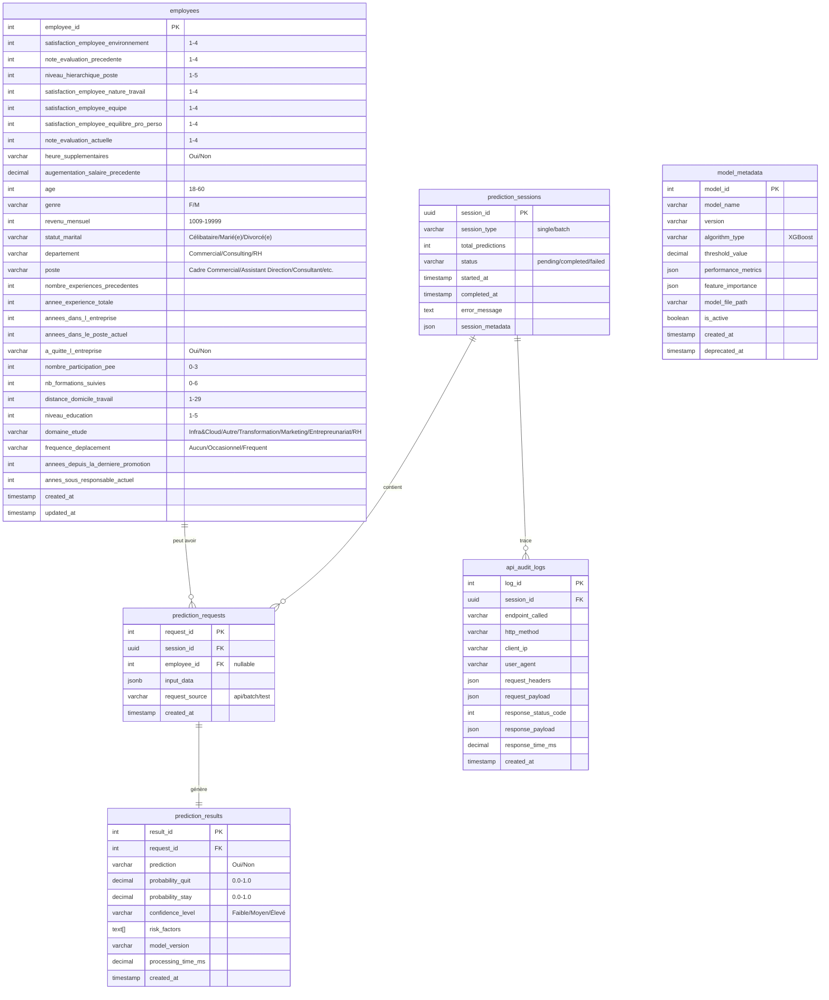

# Schéma UML - Base de données Futurisys ML

## Architecture générale



## Tables détaillées

### Table `employees` (Dataset Projet 4)
**1470 lignes, 28 colonnes (27 features + target)**

| Colonne | Type SQL | Contraintes | Description |
|---------|----------|-------------|-------------|
| employee_id | SERIAL PRIMARY KEY | NOT NULL | ID unique auto-incrémenté |
| satisfaction_employee_environnement | INTEGER | CHECK (value BETWEEN 1 AND 4) NOT NULL | Satisfaction environnement |
| note_evaluation_precedente | INTEGER | CHECK (value BETWEEN 1 AND 4) NOT NULL | Note évaluation précédente |
| niveau_hierarchique_poste | INTEGER | CHECK (value BETWEEN 1 AND 5) NOT NULL | Niveau hiérarchique |
| satisfaction_employee_nature_travail | INTEGER | CHECK (value BETWEEN 1 AND 4) NOT NULL | Satisfaction nature travail |
| satisfaction_employee_equipe | INTEGER | CHECK (value BETWEEN 1 AND 4) NOT NULL | Satisfaction équipe |
| satisfaction_employee_equilibre_pro_perso | INTEGER | CHECK (value BETWEEN 1 AND 4) NOT NULL | Équilibre vie pro/perso |
| note_evaluation_actuelle | INTEGER | CHECK (value BETWEEN 1 AND 4) NOT NULL | Note évaluation actuelle |
| heure_supplementaires | VARCHAR(5) | CHECK (value IN ('Oui', 'Non')) NOT NULL | Heures supplémentaires |
| augementation_salaire_precedente | DECIMAL(6,4) | NOT NULL | Pourcentage augmentation |
| age | INTEGER | CHECK (age BETWEEN 18 AND 60) NOT NULL | Âge employé |
| genre | VARCHAR(5) | CHECK (genre IN ('F', 'M')) NOT NULL | Genre |
| revenu_mensuel | INTEGER | CHECK (revenu_mensuel BETWEEN 1000 AND 20000) NOT NULL | Salaire mensuel |
| statut_marital | VARCHAR(20) | CHECK (value IN ('Célibataire', 'Marié(e)', 'Divorcé(e)')) NOT NULL | Statut marital |
| departement | VARCHAR(30) | CHECK (value IN ('Commercial', 'Consulting', 'Ressources Humaines')) NOT NULL | Département |
| poste | VARCHAR(50) | CHECK (poste IN ('Cadre Commercial', 'Assistant de Direction', 'Consultant', 'Tech Lead', 'Manager', 'Senior Manager', 'Représentant Commercial', 'Directeur Technique', 'Ressources Humaines')) NOT NULL | Poste occupé |
| nombre_experiences_precedentes | INTEGER | CHECK (value >= 0) NOT NULL | Expériences précédentes |
| annee_experience_totale | INTEGER | CHECK (value >= 0) NOT NULL | Expérience totale |
| annees_dans_l_entreprise | INTEGER | CHECK (value >= 0) NOT NULL | Ancienneté entreprise |
| annees_dans_le_poste_actuel | INTEGER | CHECK (value >= 0) NOT NULL | Ancienneté poste |
| a_quitte_l_entreprise | VARCHAR(5) | CHECK (value IN ('Oui', 'Non')) NOT NULL | Target variable |
| nombre_participation_pee | INTEGER | CHECK (value BETWEEN 0 AND 3) NOT NULL | Participations PEE |
| nb_formations_suivies | INTEGER | CHECK (value BETWEEN 0 AND 6) NOT NULL | Formations suivies |
| distance_domicile_travail | INTEGER | CHECK (value BETWEEN 1 AND 29) NOT NULL | Distance domicile |
| niveau_education | INTEGER | CHECK (value BETWEEN 1 AND 5) NOT NULL | Niveau éducation |
| domaine_etude | VARCHAR(50) | CHECK (domaine_etude IN ('Infra & Cloud', 'Autre', 'Transformation Digitale', 'Marketing', 'Entrepreunariat', 'Ressources Humaines')) NOT NULL | Domaine d'étude |
| frequence_deplacement | VARCHAR(20) | CHECK (value IN ('Aucun', 'Occasionnel', 'Frequent')) NOT NULL | Fréquence déplacement |
| annees_depuis_la_derniere_promotion | INTEGER | CHECK (value >= 0) NOT NULL | Années depuis promotion |
| annes_sous_responsable_actuel | INTEGER | CHECK (value >= 0) NOT NULL | Années sous responsable |
| created_at | TIMESTAMP | DEFAULT CURRENT_TIMESTAMP | Date création |
| updated_at | TIMESTAMP | DEFAULT CURRENT_TIMESTAMP | Dernière modification |

### Contraintes CHECK détaillées pour variables catégorielles

```sql
-- Contrainte pour poste (9 valeurs possibles)
ALTER TABLE employees ADD CONSTRAINT check_poste 
CHECK (poste IN (
    'Cadre Commercial',
    'Assistant de Direction', 
    'Consultant',
    'Tech Lead',
    'Manager',
    'Senior Manager',
    'Représentant Commercial',
    'Directeur Technique',
    'Ressources Humaines'
));

-- Contrainte pour domaine_etude (6 valeurs possibles) 
ALTER TABLE employees ADD CONSTRAINT check_domaine_etude
CHECK (domaine_etude IN (
    'Infra & Cloud',
    'Autre', 
    'Transformation Digitale',
    'Marketing',
    'Entrepreunariat',
    'Ressources Humaines'
));
```

## Index de performance pour `employees`
```sql
-- Index sur les colonnes de recherche fréquente
CREATE INDEX idx_employees_departement ON employees(departement);
CREATE INDEX idx_employees_poste ON employees(poste);
CREATE INDEX idx_employees_target ON employees(a_quitte_l_entreprise);
CREATE INDEX idx_employees_age_revenu ON employees(age, revenu_mensuel);
CREATE INDEX idx_employees_created_at ON employees(created_at);
```

### Table `prediction_sessions` (Métadonnées des sessions)
| Colonne | Type SQL | Contraintes | Description |
|---------|----------|-------------|-------------|
| session_id | UUID PRIMARY KEY | DEFAULT gen_random_uuid() | ID unique session |
| session_type | VARCHAR(10) | CHECK (session_type IN ('single', 'batch')) NOT NULL | Type de session |
| total_predictions | INTEGER | DEFAULT 0 | Nombre total prédictions |
| status | VARCHAR(20) | CHECK (status IN ('pending', 'completed', 'failed')) DEFAULT 'pending' | Statut session |
| started_at | TIMESTAMP | DEFAULT CURRENT_TIMESTAMP | Début session |
| completed_at | TIMESTAMP | NULL | Fin session |
| error_message | TEXT | NULL | Message d'erreur si échec |
| session_metadata | JSONB | NULL | Métadonnées additionnelles |

### Table `prediction_requests` (Inputs du modèle)
| Colonne | Type SQL | Contraintes | Description |
|---------|----------|-------------|-------------|
| request_id | SERIAL PRIMARY KEY | NOT NULL | ID unique requête |
| session_id | UUID | REFERENCES prediction_sessions(session_id) NOT NULL | Session parente |
| employee_id | INTEGER | REFERENCES employees(employee_id) NULL | Employé source (si applicable) |
| input_data | JSONB | NOT NULL | Données d'entrée complètes |
| request_source | VARCHAR(20) | CHECK (request_source IN ('api', 'batch', 'test')) DEFAULT 'api' | Source requête |
| created_at | TIMESTAMP | DEFAULT CURRENT_TIMESTAMP | Date création |

### Table `prediction_results` (Outputs du modèle)
| Colonne | Type SQL | Contraintes | Description |
|---------|----------|-------------|-------------|
| result_id | SERIAL PRIMARY KEY | NOT NULL | ID unique résultat |
| request_id | INTEGER | REFERENCES prediction_requests(request_id) NOT NULL | Requête source |
| prediction | VARCHAR(5) | CHECK (prediction IN ('Oui', 'Non')) NOT NULL | Prédiction |
| probability_quit | DECIMAL(6,4) | CHECK (probability_quit BETWEEN 0 AND 1) NOT NULL | Probabilité départ |
| probability_stay | DECIMAL(6,4) | CHECK (probability_stay BETWEEN 0 AND 1) NOT NULL | Probabilité rester |
| confidence_level | VARCHAR(10) | CHECK (confidence_level IN ('Faible', 'Moyen', 'Élevé')) NOT NULL | Niveau confiance |
| risk_factors | TEXT[] | NULL | Facteurs de risque |
| model_version | VARCHAR(20) | NOT NULL | Version modèle utilisé |
| processing_time_ms | DECIMAL(10,2) | NULL | Temps de traitement |
| created_at | TIMESTAMP | DEFAULT CURRENT_TIMESTAMP | Date création |

### Table `model_metadata` (Versioning des modèles)
| Colonne | Type SQL | Contraintes | Description |
|---------|----------|-------------|-------------|
| model_id | SERIAL PRIMARY KEY | NOT NULL | ID unique modèle |
| model_name | VARCHAR(100) | NOT NULL | Nom du modèle |
| version | VARCHAR(20) | NOT NULL UNIQUE | Version (ex: "1.0.0") |
| algorithm_type | VARCHAR(50) | DEFAULT 'XGBoost' | Type d'algorithme |
| threshold_value | DECIMAL(6,4) | DEFAULT 0.5 | Seuil de décision |
| performance_metrics | JSONB | NULL | Métriques performance |
| feature_importance | JSONB | NULL | Importance des features |
| model_file_path | VARCHAR(255) | NULL | Chemin fichier modèle |
| is_active | BOOLEAN | DEFAULT TRUE | Modèle actif |
| created_at | TIMESTAMP | DEFAULT CURRENT_TIMESTAMP | Date création |
| deprecated_at | TIMESTAMP | NULL | Date dépréciation |

### Table `api_audit_logs` (Audit complet API)
| Colonne | Type SQL | Contraintes | Description |
|---------|----------|-------------|-------------|
| log_id | BIGSERIAL PRIMARY KEY | NOT NULL | ID unique log |
| session_id | UUID | REFERENCES prediction_sessions(session_id) NULL | Session associée |
| endpoint_called | VARCHAR(100) | NOT NULL | Endpoint appelé |
| http_method | VARCHAR(10) | NOT NULL | Méthode HTTP |
| client_ip | INET | NULL | IP client |
| user_agent | TEXT | NULL | User agent |
| request_headers | JSONB | NULL | Headers requête |
| request_payload | JSONB | NULL | Payload requête |
| response_status_code | INTEGER | NOT NULL | Code statut réponse |
| response_payload | JSONB | NULL | Payload réponse |
| response_time_ms | DECIMAL(10,2) | NULL | Temps de réponse |
| created_at | TIMESTAMP | DEFAULT CURRENT_TIMESTAMP | Timestamp log |

## Relations et contraintes

### Relations principales
- **employees** ← prediction_requests (optionnel, pour traçabilité source)
- **prediction_sessions** → prediction_requests (1:N)
- **prediction_requests** → prediction_results (1:1)
- **prediction_sessions** ← api_audit_logs (optionnel, pour audit)

### Contraintes métier
1. **Cohérence probabilités** : `probability_quit + probability_stay = 1.0`
2. **Session complétée** : Si `status = 'completed'`, alors `completed_at IS NOT NULL`
3. **Résultat unique** : Chaque `request_id` ne peut avoir qu'un seul résultat
4. **Modèle actif unique** : Un seul modèle avec `is_active = TRUE` par version

## Index de performance
```sql
-- Sessions
CREATE INDEX idx_sessions_type_status ON prediction_sessions(session_type, status);
CREATE INDEX idx_sessions_started_at ON prediction_sessions(started_at);

-- Requêtes
CREATE INDEX idx_requests_session_id ON prediction_requests(session_id);
CREATE INDEX idx_requests_created_at ON prediction_requests(created_at);

-- Résultats  
CREATE INDEX idx_results_request_id ON prediction_results(request_id);
CREATE INDEX idx_results_prediction ON prediction_results(prediction);
CREATE INDEX idx_results_model_version ON prediction_results(model_version);

-- Audit logs
CREATE INDEX idx_audit_session_id ON api_audit_logs(session_id);
CREATE INDEX idx_audit_endpoint ON api_audit_logs(endpoint_called);
CREATE INDEX idx_audit_created_at ON api_audit_logs(created_at);
```

## Volumétrie estimée (local)
- **employees** : 1,470 lignes (fixe)
- **prediction_sessions** : ~100/jour
- **prediction_requests** : ~500/jour  
- **prediction_results** : ~500/jour
- **api_audit_logs** : ~1000/jour

**Total estimé après 1 an** : ~400k lignes (acceptable en local)